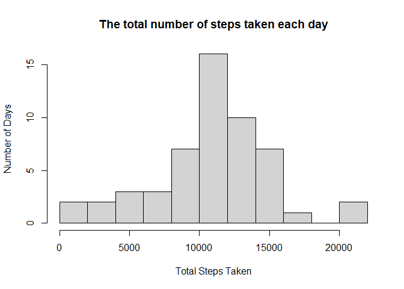
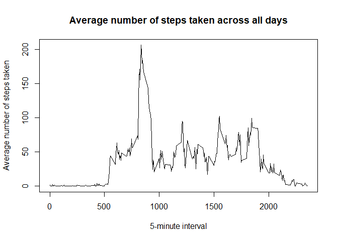
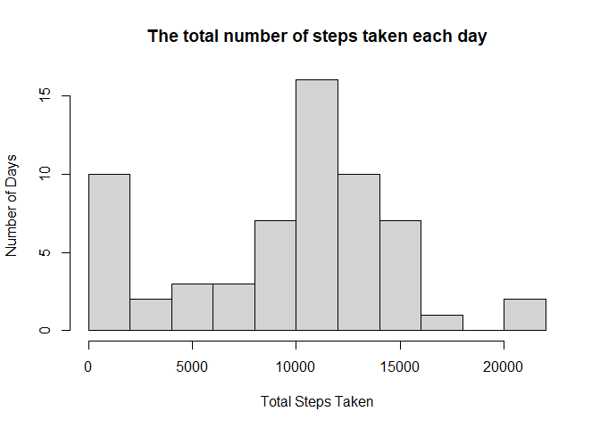
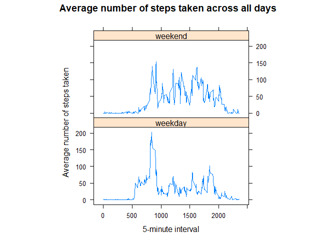

The activity data is collected from a personal activity monitoring device. This device collects data at 5 minute intervals throughout the day. The data consist of two months of data from an anonymus individual and include the number of steps taken in 5 minute intervals each day. The dataset has a total of 17568 observations.

The variables included are:  
* steps: Number of steps taking in a 5-minute interval  
* date: The date on which the measurement was taken  
* interval: Identifier for the 5-minute interval in which measurement was taken

## Loading and preprocessing the data
Unzip and load data

```r
activity <- read.csv(unz("activity.zip", "activity.csv"))
```

## What is mean total number of steps taken per day?
Total number of steps taken per day

```r
totalsteps <- aggregate(steps ~ date, data = activity, sum)
hist(totalsteps$steps, xlab = "Total Steps Taken", ylab = "Number of Days", main = "The total number of steps taken each day", breaks = 8)
```

<!-- -->

The mean and median of the total number of steps taken per day

```r
meansteps <- mean(totalsteps$steps)
mediansteps <- median(totalsteps$steps)
```

The mean of the total number of steps taken per day is 1.0766189\times 10^{4}.  
The median of the total number of steps taken per day is 10765.

## What is the average daily activity pattern?
Time series plot of the 5-minute interval (x-axis) and the average number of steps taken, averaged across all days (y-axis)

```r
stepsinterval <- aggregate(steps ~ interval, data = activity, mean)
plot(stepsinterval$interval, stepsinterval$steps, type = "l", xlab = "5-minute interval", ylab = "Average number of steps taken", main = "Average number of steps taken across all days")
```

<!-- -->

Maximum number of steps

```r
maximum <- stepsinterval$interval[which.max(stepsinterval$steps)]
```

The maximum number of steps occurs at the 835th interval.

## Imputing missing values
The total number of missing values

```r
missing <- nrow(activity[is.na(activity$steps),])
```

The total number of missing values in the dataset is 2304.

Filling in all of the missing values by letting NA values be zeros and create a new dataset

```r
activitynoNA <- activity
activitynoNA[is.na(activitynoNA$steps), "steps"] <- 0
```

The histogram of the total number of steps taken each day

```r
totalstepsnoNA <- aggregate(steps ~ date, data = activitynoNA, sum)
hist(totalstepsnoNA$steps, xlab = "Total Steps Taken", ylab = "Number of Days", main = "The total number of steps taken each day", breaks = 8)
```

<!-- -->

The mean and median of the total number of steps taken per day

```r
meanstepsnoNA <- mean(totalstepsnoNA$steps)
medianstepsnoNA <- median(totalstepsnoNA$steps)
```

The mean of the total number of steps taken per day is 9354.2295082.  
The median of the total number of steps taken per day is 1.0395\times 10^{4}.  

The mean and median values differ from the estimates from the first part of the assignment. Imputing missing data on the estimate of the total daily number of steps resulted a left shift to zero and affected the mean and median values.

## Are there differences in activity patterns between weekdays and weekends?
Create a new factor variable in the dataset with two levels: weekdays and weekend

```r
activitynoNA$day <- ifelse(as.POSIXlt(as.Date(activitynoNA$date))$wday%%6 == 0, "weekend", "weekday")
activitynoNA$day <- factor(activitynoNA$day, levels = c("weekday", "weekend"))
```

Panel plot of the 5-minute interval(x-axis) and the average number of steps taken, averaged across all weekday days or weekend days(y-axis)

```r
stepsintervalnoNA <- aggregate(steps ~ interval + day, data = activitynoNA, mean)
library(lattice)
xyplot(steps ~ interval | factor(day), data = stepsintervalnoNA, aspect = 1/2, type = "l", xlab = "5-minute interval", ylab = "Average number of steps taken", main = "Average number of steps taken across all days")
```

<!-- -->

